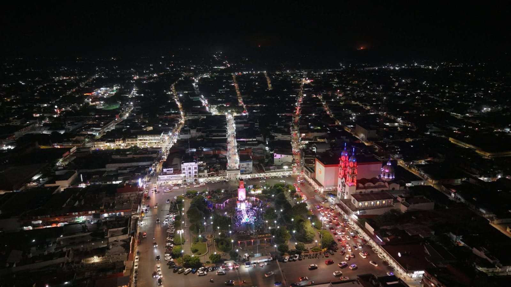
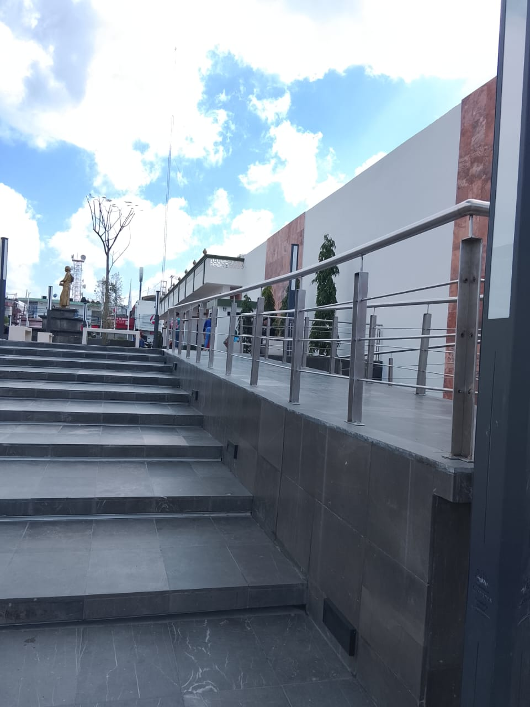

> **"Explorando el mundo, un píxel a la vez."**

Este proyecto es una bitácora personal donde convergen mis dos grandes pasiones: la **Ingeniería en Sistemas** y los **viajes**. A través de una interfaz moderna y animada, comparto historias de lugares como Cárdenas y Ciudad Juárez, integrando herramientas de automatización y atención al usuario.

###  Tecnologías que use

###  Mi blog integra:

* **Edustente:** Un chatbot integrado mediante n8n para resolver dudas sobre el autor de forma interactiva.
* **Sistema de Suscripción:** Integración robusta con **EmailJS** para notificaciones automatizadas en tiempo real.
* **Experiencia Visual:** Animaciones fluidas utilizando **Three.js**, GSAP y efectos de desplazamiento con WOW.js.
* **Diseño Responsive:** Adaptabilidad total para móviles y escritorio gracias a Bootstrap 5.

###  Galería de Destinos

| Cárdenas | Ciudad Juárez |
| :---: | :---: |
|  |  |
| *La belleza de la zona remodelada.* | *Monumento.* |

### 👤 Sobre mi

**Soy Eduardo Cordova** Estudiante de Ingeniería en Sistemas apasionado por la ciberseguridad, el análisis de vulnerabilidades y, ocasionalmente, capturar la esencia de nuevos lugares.

  Hecho por <a href="https://github.com/eduseso-66">Eduardo Córdova</a>

